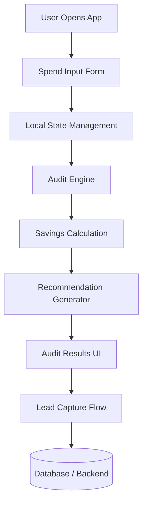

# Architecture Overview

## System Architecture

---

# Data Flow

1. The user lands on the homepage and enters information about their AI tool usage.

2. The frontend stores the form state locally to preserve user progress across reloads.

3. Once submitted, the audit engine evaluates:
   - current monthly spend
   - team size
   - selected plans
   - usage category

4. The application applies rule-based business logic to determine:
   - possible downgrades
   - alternative tools
   - estimated savings
   - optimization opportunities

5. Results are displayed immediately with:
   - monthly savings
   - annual savings
   - recommendation explanations

6. Users can optionally submit contact information for follow-up.

---

# Stack Choice

## Next.js

I chose Next.js because:
- it supports production-ready React applications
- deployment to Vercel is straightforward
- routing and scalability are easier compared to plain React
- it provides strong ecosystem support

## TypeScript

TypeScript improves:
- maintainability
- type safety
- debugging
- developer experience

For a financial recommendation product, predictable data handling is important.

## Tailwind CSS

Tailwind CSS was selected because it:
- speeds up UI development
- simplifies responsive design
- reduces custom CSS overhead

## Vercel

Vercel was chosen because:
- it integrates naturally with Next.js
- deployments are fast
- preview deployments improve iteration speed

---

# Audit Engine Design

The audit engine uses deterministic rule-based logic instead of fully AI-generated financial recommendations.

This decision was intentional because:
- pricing recommendations should be explainable
- predictable logic is easier to test
- financial outputs require consistency

Example rules include:
- detecting overpayment for small teams on enterprise plans
- recommending cheaper alternatives for mixed-use teams
- calculating annual savings opportunities

---

# Scalability Considerations

If this application needed to support 10,000+ audits per day, I would:

## 1. Move audit logic into dedicated API routes
This would separate frontend rendering from business logic.

## 2. Add persistent backend storage
A database such as Supabase or PostgreSQL would store:
- audit reports
- leads
- analytics
- historical comparisons

## 3. Introduce caching
Pricing data and repeated recommendation logic could be cached for performance.

## 4. Add monitoring and analytics
Tools such as:
- Sentry
- PostHog
- Vercel Analytics

would improve debugging and product analysis.

## 5. Improve recommendation sophistication
Future versions could combine:
- rule-based logic
- lightweight AI summaries
- benchmark comparisons

to provide more personalized recommendations.
